# Computer Vision Object Sorter

[](https://github.com/VivekVRobo/cv-object-sorter/actions/workflows/python.yml)

A modular OpenCV robotics stack for detecting colored objects on a conveyor/work surface, stabilizing the classification, firing **once per object passage**, and issuing deterministic sort commands to a microcontroller-driven diverter.

> **Status:** software/vision reference with deterministic CI evidence. Real camera accuracy, conveyor timing, actuator timing, and physical sort success remain evidence-gated until a representative labeled image set and physical sorter exist.

## Project snapshot

| | |
|---|---|
| **Problem** | Detect an object, classify it, trigger once, and convert the vision result into a deterministic physical sorting command. |
| **Vision stack** | OpenCV, HSV segmentation, morphology, contour/area filtering, centroid + bounding-box extraction |
| **Trigger semantics** | Passage-aware state machine: N stable in-gate frames → one fire → latched until object clears the gate |
| **Control bridge** | Cooldown-protected serial protocol + Arduino servo diverter |
| **Configuration** | Color ranges live in `config/colors.yaml` instead of being embedded in detector code |
| **Software evidence** | Deterministic synthetic threshold-contract suite + confusion matrix + CI artifact |
| **Real-data evaluator** | `tools/evaluate_dataset.py` evaluates `dataset/<label>/...` and emits JSON + per-image CSV |
| **Current maturity** | Software/vision reference; real lighting, conveyor timing and actuator mechanics remain evidence-gated |
| **Next proof milestone** | Capture a representative real image set, publish confusion/accuracy, then add missed/duplicate-trigger and timing evidence on the physical sorter |

## Why this project exists

The useful engineering problem is larger than “detect a red object.” A real sorter must keep detection, triggering, actuator commands and calibration assumptions explicit so the same object is not fired repeatedly and software claims are not confused with physical sorting performance.

## Pipeline

```mermaid
flowchart LR
    C[Camera frame] --> H[BGR → HSV]
    H --> M[Configurable color masks]
    M --> F[Morphology / noise cleanup]
    F --> O[Contour + area filtering]
    O --> D[Centroid / bounding box]
    D --> G[Passage trigger state machine]
    G --> P[Cooldown-protected serial command]
    P --> A[Arduino actuator]
    A --> S[Physical sorting gate]
```



## Trigger behavior

The runtime does not simply call the actuator on every frame in the trigger band.

For one object passage:

```text
outside gate
    ↓
inside gate / frame 1
    ↓
inside gate / frame 2
    ↓
inside gate / frame 3
    ↓
FIRE ONCE
    ↓
passage latched
    ↓
object leaves / detection clears for N frames
    ↓
re-arm
```

Defaults:

```text
stable frames required: 3
clear/reset frames:      3
actuator cooldown:       1.0 s
```

These are software defaults, not validated conveyor timing parameters.

## Supported reference classes

- Red
- Green
- Blue
- Unknown/no detection

The reference ranges live in [`config/colors.yaml`](config/colors.yaml). They are deliberately treated as calibration starting points, not universal color thresholds.

## Install

```bash
python -m venv .venv
# Windows: .venv\Scripts\activate
# Linux/macOS: source .venv/bin/activate
pip install -e .
```

The package metadata declares OpenCV, NumPy, PyYAML, and pyserial runtime dependencies. For tests:

```bash
pip install pytest
```

## Run with webcam

Start in dry-run mode:

```bash
cv-object-sorter --dry-run
```

or:

```bash
python sorter.py --dry-run
```

Useful trigger controls:

```bash
cv-object-sorter \
  --dry-run \
  --stable-frames 3 \
  --reset-frames 3 \
  --cooldown-s 1.0
```

Use another camera index:

```bash
cv-object-sorter --camera 1 --dry-run
```

Connect a programmed actuator controller:

```bash
cv-object-sorter --port COM5
# Linux example: --port /dev/ttyACM0
```

Press `q` to quit.

## Serial protocol

The host sends newline-terminated single-character commands:

```text
R = red bin
G = green bin
B = blue bin
N = neutral/home
```

The included Arduino example controls a hobby servo diverter. Its angles are placeholders and **must** be calibrated to the real mechanism.

## Software evidence available now

When a physical sorter or real camera dataset is unavailable, CI still exercises the complete HSV → morphology → contour → primary-detection path using deterministic synthetic cases:

```bash
python tools/synthetic_vision_evidence.py
```

Output:

```text
artifacts/synthetic-vision-evidence.json
```

The artifact contains a confusion matrix and per-class results, but carries explicit claim boundaries:

```text
evidence_type: synthetic_threshold_contract_validation
hardware_evidence: false
real_camera_dataset: false
```

The synthetic suite samples configured red/green/blue threshold boundaries, multiple saturation/value levels, multiple shapes, and deliberately out-of-range colors. It is useful for catching regressions in the configured software contract. **It is not a real-world camera accuracy benchmark.**

GitHub Actions regenerates this artifact on every relevant commit and uploads it as `cv-sorter-software-evidence`.

## Real labeled-image evaluation path

When representative images become available, arrange them as:

```text
dataset/
├── red/
├── green/
├── blue/
└── unknown/
```

Then run:

```bash
python tools/evaluate_dataset.py dataset \
  --output artifacts/dataset-evaluation.json \
  --predictions-csv artifacts/dataset-predictions.csv
```

The evaluator reports:

- total samples and accuracy;
- per-class accuracy;
- confusion matrix;
- predicted label for every image;
- detection count and primary contour area.

A publishable real-camera dataset should also document camera, lens/resolution, exposure/white balance, lighting, object set, background, distance, and whether images were selected before or after threshold tuning.

## Calibration

1. Lock camera position and exposure/white balance if possible.
2. Capture representative objects under real lighting.
3. Split calibration/tuning images from held-out evaluation images.
4. Inspect HSV values and tune `config/colors.yaml` using only the calibration set.
5. Run `tools/evaluate_dataset.py` on the held-out set.
6. Tune minimum contour area to reject noise.
7. Set the trigger band and passage-state parameters so each object fires once.
8. Verify serial commands in dry-run/logging mode.
9. Calibrate diverter positions with the conveyor stopped.
10. Only then test moving objects at low conveyor speed.

See [`docs/CALIBRATION.md`](docs/CALIBRATION.md).

## Tests

```bash
pytest -q
```

Tests cover HSV range behavior, command encoding, passage-trigger latch/re-arm behavior, and evaluation/confusion-matrix logic. CI additionally runs the synthetic vision evidence generator end to end.

## Repository layout

```text
.
├── src/cv_sorter/
│   ├── colors.py
│   ├── detector.py
│   ├── trigger.py
│   ├── evaluation.py
│   ├── actuator.py
│   └── app.py
├── tools/
│   ├── synthetic_vision_evidence.py
│   └── evaluate_dataset.py
├── config/colors.yaml
├── firmware/sorter_actuator/sorter_actuator.ino
├── tests/
├── docs/
├── sorter.py
└── pyproject.toml
```

## Evidence maturity

| Gate | Current |
|---|---|
| HSV/config parsing | ✅ tested |
| Detection/morphology software path | ✅ CI-exercised |
| Passage-aware single-fire trigger | ✅ tested |
| Serial command encoding | ✅ tested |
| Deterministic synthetic threshold-contract evidence | ✅ CI-generated |
| Real labeled-camera dataset | ❌ |
| Held-out real-image confusion/accuracy | ❌ |
| Conveyor missed/duplicate-trigger benchmark | ❌ |
| Actuator command-to-sort timing | ❌ |
| Physical sorting success rate | ❌ |

## Physical validation roadmap

A meaningful hardware milestone should include:

1. a fixed camera/lighting setup and documented HSV calibration;
2. a labeled test set across all supported classes;
3. held-out classification accuracy/confusion results under representative lighting;
4. duplicate-trigger and missed-trigger counts at a stated conveyor speed;
5. actuator command-to-sort timing measurements;
6. physical sort success rate by class;
7. real sorter video plus failure cases, not only successful examples.

## Limitations

HSV thresholding is intentionally explainable and lightweight but can fail under strong illumination changes, reflections, shadows, white-balance drift, or similar colors. The current primary-object selection is area-based rather than identity-tracked across frames. A future detector can replace HSV classification while retaining the passage-trigger and actuator architecture.

## License

MIT — see [`LICENSE`](LICENSE).
